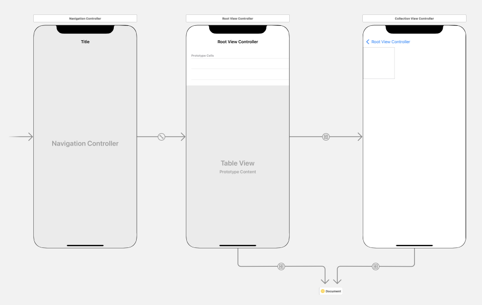
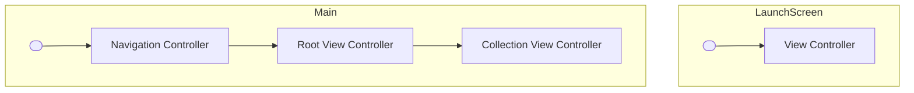

# StoryboardGraph

This experimental script takes a collection of [Storyboard](https://developer.apple.com/library/archive/documentation/ToolsLanguages/Conceptual/Xcode_Overview/DesigningwithStoryboards.html) files and produces a unified chart in [Mermaid](https://mermaid-js.github.io).

For example it can takes storyboards that look like this:



and produces a chart like this:


## Usage

```shell
usage: storyboard-graph.py [-h] storyboard [storyboard ...]

Visualise a collection of storyboards as a unified directed graph

positional arguments:
  storyboard  Path to Storyboards

optional arguments:
  -h, --help  show this help message and exit
```

## Example

```shell
python3 storyboard-graph.py examples/*.storyboard
```


